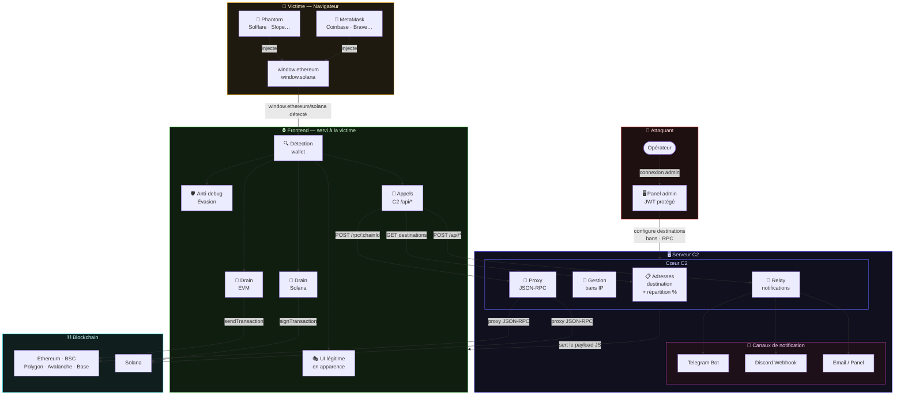
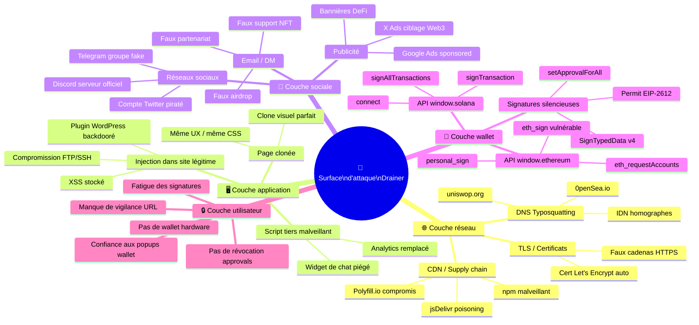
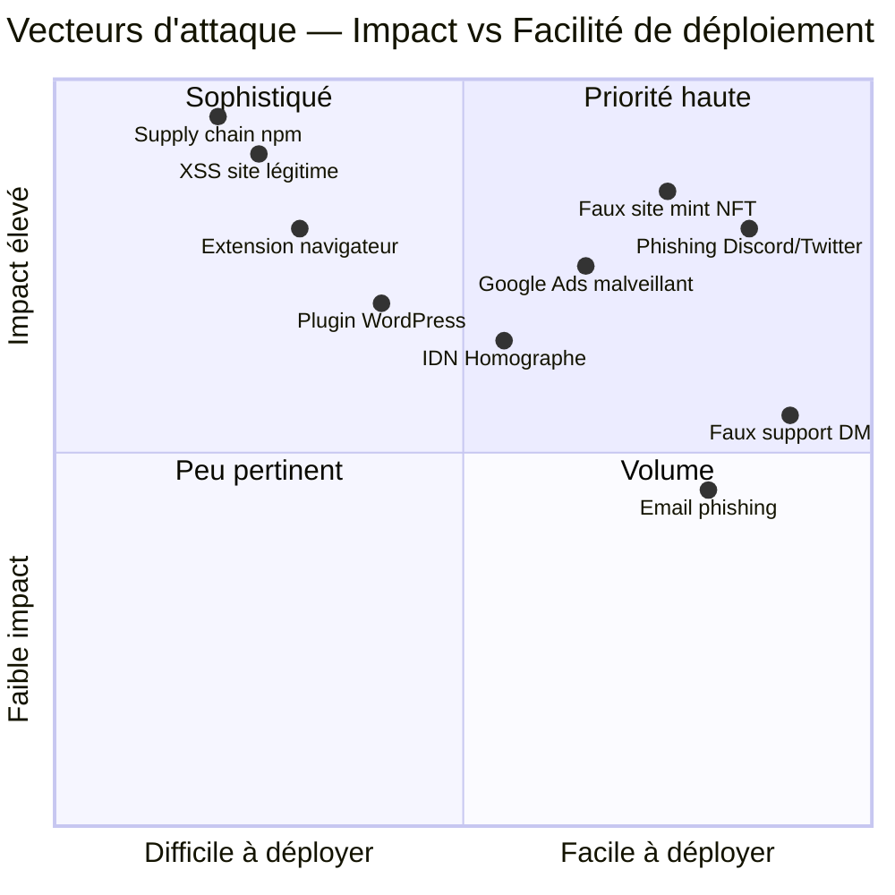
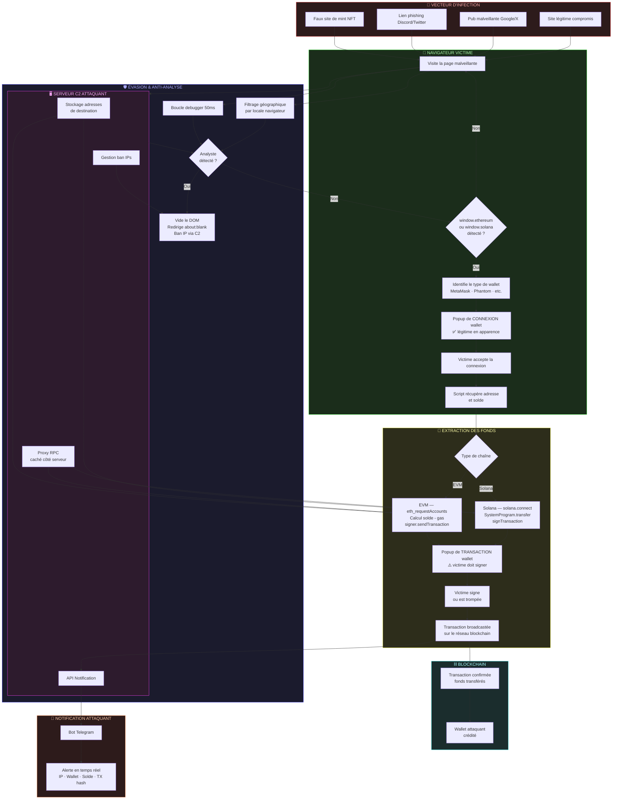
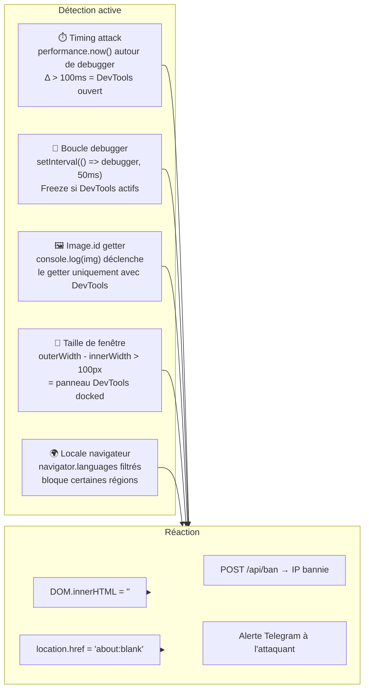

# 🔬 Crypto Wallet Drainers — Analyse théorique & défense

## Vidéo

<video width="600" controls>
  <source src="assets/poc_drainer.mp4" type="video/mp4">
</video>


> Document de recherche en sécurité Web3 · Usage éducatif uniquement

---

## Table des matières

1. [Qu'est-ce qu'un wallet drainer ?](#1-quest-ce-quun-wallet-drainer-)
2. [Surface d'attaque](#2-surface-dattaque)
3. [Architecture typique](#3-architecture-typique)
4. [Vecteurs d'infection](#4-vecteurs-dinfection)
5. [Mécanismes techniques](#5-mécanismes-techniques)
   - 5.1 [Détection du wallet](#51-détection-du-wallet)
   - 5.2 [Connexion & consentement](#52-connexion--consentement)
   - 5.3 [Extraction des fonds (EVM)](#53-extraction-des-fonds-evm)
   - 5.4 [Extraction des fonds (Solana)](#54-extraction-des-fonds-solana)
   - 5.5 [Techniques d'évasion](#55-techniques-dévasion)
   - 5.6 [Exfiltration des données](#56-exfiltration-des-données)
6. [Infrastructure C2](#6-infrastructure-c2)
7. [Indicateurs de compromission (IOC)](#7-indicateurs-de-compromission-ioc)
8. [Défenses & recommandations](#8-défenses--recommandations)
9. [Ressources complémentaires](#9-ressources-complémentaires)
10. [Disclaimer](#10-disclaimer)

---

## 1. Qu'est-ce qu'un wallet drainer ?

Un **wallet drainer** est un script malveillant injecté dans une page web dont l'objectif est de vider automatiquement les fonds d'un portefeuille crypto sans que la victime comprenne ce qui se passe.

Il se distingue d'autres formes de vol crypto par :

| Caractéristique | Drainer | Phishing classique | Clipboard hijacker |
|---|---|---|---|
| Vol de clé privée | Non (optionnel) | Oui | Non |
| Interaction victime requise | Minimale | Oui | Non |
| Réseau ciblé | EVM, Solana, etc. | Tous | Tous |
| Vitesse d'exécution | Immédiate | Différée | Différée |
| Difficulté de détection | Élevée | Moyenne | Faible |

Les drainers sont devenus industrialisés à partir de 2022 avec l'essor des NFT et des DeFi, donnant naissance à des kits vendus sous forme de **Drainer-as-a-Service (DaaS)**.

---

## 2. Surface d'attaque

```
Victime
  └─► Visite une page malveillante (phishing, typosquatting, pub malveillante…)
        └─► Script drainer chargé dans le navigateur
              └─► Interagit avec l'extension wallet de la victime (MetaMask, Phantom…)
                    └─► Transactions signées → fonds transférés vers attaquant
```

**Points d'entrée courants :**
- Sites de mint NFT frauduleux
- Faux portails DeFi / airdrops
- Liens dans des tweets/discords de comptes compromis
- Publicités Google / X ciblant des termes Web3
- Extensions de navigateur malveillantes

---

## 3. Architecture typique

Un drainer complet se compose généralement de trois couches :



---

## 4. Vecteurs d'infection

### 4.1 Compromission de sites légitimes
Des attaquants injectent le script dans des sites existants via :
- Vulnérabilités CMS (WordPress, plugins)
- Supply chain (bibliothèques npm malveillantes)
- Compromission d'accès FTP/SSH

### 4.2 Sites clonés (phishing)
Réplication visuelle d'un site connu (Uniswap, OpenSea, etc.) avec un domaine similaire (typosquatting, IDN homograph).

### 4.3 Publicité malveillante (Malvertising)
Des annonces payantes redirigent vers des pages de drain après un clic. Particulièrement efficace car les victimes font confiance aux résultats sponsorisés.

### 4.4 Ingénierie sociale
- Faux airdrops sur les réseaux sociaux
- Comptes officiels de projets piratés (Twitter/Discord)
- Faux support technique demandant de "valider" son wallet

### 4.5 Surface d'attaque — Cartographie complète



---

### 4.6 Matrice des vecteurs × cibles



---

## 5. Mécanismes techniques

### 5.1 Détection du wallet

Le script inspecte les objets JavaScript injectés par les extensions wallet :

- `window.ethereum` → wallets EVM (MetaMask, Coinbase, Brave, Rainbow…)
- `window.solana` → Phantom, Solflare, Slope…
- `window.bitcoin` → wallets BTC natifs

Les propriétés de ces objets (`isMetaMask`, `isTrust`, etc.) permettent d'identifier précisément le wallet pour adapter le comportement du drainer.

### 5.2 Connexion & consentement

Le drainer invoque l'API standard du wallet :
- **EVM** : `eth_requestAccounts` → affiche une popup de connexion **légitime** dans l'extension
- **Solana** : `window.solana.connect()` → idem

⚠️ **Point clé** : la victime voit une vraie popup de son extension — rien d'anormal en apparence. Le consentement à "connecter" son wallet est distinct du consentement à signer des transactions.

### 5.3 Extraction des fonds (EVM)

Après connexion, le drainer récupère le solde et construit une transaction :

```
1. Récupérer le solde natif (ETH, BNB, MATIC…)
2. Calculer les frais de gas
3. Soustraire les frais du solde → montant à voler
4. Construire une transaction vers l'adresse de l'attaquant
5. Appeler signer.sendTransaction() → popup de confirmation dans le wallet
```

Des variantes plus sophistiquées utilisent :
- **`eth_sign` / `personal_sign`** : contournement sans popup de transaction (déprécié mais encore exploité)
- **`Permit` / EIP-2612** : signature hors-chaîne qui autorise un tiers à dépenser des tokens ERC-20
- **`setApprovalForAll`** : approuve le transfert de tous les NFTs d'une collection en une signature
- **Multicall** : regroupe plusieurs transferts en une seule transaction pour vider tokens + NFTs simultanément

### 5.4 Extraction des fonds (Solana)

Sur Solana, le mécanisme diffère :

```
1. Connexion via window.solana.connect()
2. Récupération du solde (lamports)
3. Construction d'une Transaction avec SystemProgram.transfer()
4. Ajout d'instructions pour chaque token SPL éventuel
5. window.solana.signTransaction() → signature par la victime
6. Envoi sur le réseau : sendRawTransaction()
```

Les drainers Solana exploitent aussi les **versioned transactions** (v0) avec des Address Lookup Tables pour obfusquer les destinations.

### 5.5 Techniques d'évasion

Les drainers intègrent plusieurs couches pour résister à l'analyse :

#### Anti-debug
- **Boucle `debugger`** : l'instruction est répétée en continu (ex: toutes les 50ms). Si les DevTools sont ouverts, l'exécution se fige.
- **Détection par timing** : mesure du delta d'exécution autour d'un `debugger`. Un délai > 100ms trahit l'ouverture des DevTools.
- **`toString()` override sur RegExp** : dans Chromium, `console.log(/regexp/)` appelle `toString()` uniquement si les DevTools sont ouverts.
- **`Image.id` getter** : même principe — le getter est déclenché par l'affichage dans la console.
- **Détection par taille de fenêtre** : `outerWidth - innerWidth > N` indique un panneau DevTools docked.

En cas de détection, le script peut :
- Vider le DOM (`document.documentElement.innerHTML = ""`)
- Rediriger vers `about:blank`
- Bannir l'IP via le backend C2

#### Filtrage géographique
Certains drainers bloquent des locales spécifiques (`ru-RU`, `be-BY`, etc.) pour éviter de cibler des ressortissants de certains pays — stratégie visant à réduire l'exposition légale dans les juridictions de l'opérateur.

#### Obfuscation du code
- Minification + mangling des noms de variables
- Encodage base64 / XOR des chaînes sensibles
- Chargement dynamique des dépendances

### 5.6 Exfiltration des données

Chaque événement est typiquement remonté à l'attaquant en temps réel :
- Visite d'un nouveau "lead" (IP, user-agent, langue)
- Wallet connecté (type, adresse, solde)
- Transaction envoyée (hash, montant en USD)
- Erreur ou blocage détecté

Le canal d'exfiltration le plus répandu est un **bot Telegram** pour sa simplicité d'intégration et sa gratuité.

---

## 6. Infrastructure C2

Le serveur de commande et contrôle joue plusieurs rôles :

| Rôle | Description |
|---|---|
| **Stockage des destinations** | Adresses wallet de l'attaquant avec répartition en % |
| **Proxy RPC** | Relaie les appels JSON-RPC vers des nœuds blockchain (Alchemy, Infura…), masquant la clé API au client |
| **Gestion des bans** | Bloque les IPs des analystes/chercheurs |
| **Notification** | Transmet les alertes vers Telegram/Discord |
| **Panel admin** | Interface de gestion protégée par JWT |

Le proxy RPC est une technique notable : plutôt que d'exposer la clé API dans le JS frontend (où elle serait visible), le backend la stocke côté serveur et proxy les requêtes. Cela complique aussi le suivi des adresses de destination par les victimes.

### Architecture interne du C2

```mermaid
flowchart LR

  subgraph INTERNET["🌐 Internet — côté victime"]
    VICTIM["Navigateur victime\nPayload JS chargé"]
  end

  subgraph C2["🖥️ Serveur C2 — Go / Node / PHP"]
    direction TB

    subgraph PUBLIC_API["Routes publiques /api/*"]
      R1["POST /api/sendMessage\n→ Telegram relay"]
      R2["GET /api/evm\n→ Adresses EVM destination"]
      R3["GET /api/solana\n→ Adresses SOL destination"]
      R4["POST /api/rpc/:chainId\n→ Proxy JSON-RPC"]
      R5["GET /api/price_eth\n→ Prix ETH temps réel"]
      R6["GET /api/price_sol\n→ Prix SOL temps réel"]
    end

    subgraph AUTH["Route auth /auth/*"]
      R7["POST /auth/login\n→ JWT token"]
    end

    subgraph PROTECTED["Routes protégées /protected/*\n🔒 JWT requis"]
      R8["POST /protected/ban\n→ Bannir une IP"]
    end

    subgraph MIDDLEWARE["Middleware stack"]
      M1["CORS"]
      M2["Security headers\nHSTS · X-Frame · XSS"]
      M3["Ban check\n→ vérifie IP bannies"]
      M4["Auth JWT\n→ routes protégées"]
      M5["Logger / Recovery"]
    end

    subgraph STORAGE["Stockage en mémoire"]
      S1["Map bannedIPs\n{IP → timestamp + raison}"]
      S2["[]EvmAddress\n{address, percent}"]
      S3["[]SolAddress\n{address, percent}"]
      S4["[]ChainEvm\n{chainId, RPC URL}"]
    end
  end

  subgraph EXTERNAL["☁️ Services externes"]
    EXT1["api.telegram.org\n→ Notification attaquant"]
    EXT2["Alchemy / Infura\n→ Nœuds blockchain"]
    EXT3["CoinGecko API\n→ Prix ETH/SOL"]
    EXT4["Blockchain mainnet\n→ Confirmation tx"]
  end

  subgraph ATTACKER["👤 Attaquant"]
    ADM["Panel admin\nnavigateur"]
    TG["📲 Telegram\nalerte temps réel"]
  end

  VICTIM -->|"POST wallet info"| R1
  VICTIM -->|"GET destinations"| R2
  VICTIM -->|"GET destinations"| R3
  VICTIM -->|"POST JSON-RPC"| R4
  VICTIM -->|"GET prix"| R5
  VICTIM -->|"GET prix"| R6

  M1 --> M2 --> M3 --> M4
  M3 --> S1

  R1 --> EXT1 --> TG
  R2 --> S2
  R3 --> S3
  R4 --> EXT2 --> EXT4
  R5 & R6 --> EXT3

  ADM -->|"POST /auth/login"| R7
  R7 -->|"Bearer JWT"| ADM
  ADM -->|"POST /protected/ban\n+ Authorization: Bearer"| R8
  R8 --> S1

  style PUBLIC_API fill:#1a2a1a,stroke:#44aa44
  style AUTH fill:#1a1a2a,stroke:#4444aa
  style PROTECTED fill:#2a1a1a,stroke:#aa4444
  style MIDDLEWARE fill:#2a2a1a,stroke:#aaaa44
  style STORAGE fill:#1a2a2a,stroke:#44aaaa
  style EXTERNAL fill:#2a1a2a,stroke:#aa44aa
  style ATTACKER fill:#2a1a1a,stroke:#ff4444
```



---

## 7. Indicateurs de compromission (IOC)

### Dans le code JS d'une page suspecte
- Présence de `window.ethereum`, `window.solana` combinée à `sendTransaction` ou `signTransaction`
- Appels vers des domaines inconnus avec des payloads JSON contenant des adresses ETH/SOL
- Boucles `setInterval` avec `debugger`
- Surcharge de `toString()` sur des objets RegExp ou Image

### Comportement réseau
- Requêtes POST vers `/api/sendMessage` ou `/api/rpc/:chainId`
- Trafic vers `api.telegram.org/bot<token>/sendMessage`
- Appels vers CoinGecko API (`/simple/price`) depuis une page qui n'en a pas besoin

### Dans le wallet
- Popup de transaction non sollicitée après simple connexion
- Transaction vers une adresse inconnue avec 100% du solde
- Demande `setApprovalForAll` sur une collection NFT

---

## 8. Défenses & recommandations

### Pour les utilisateurs

| Mesure | Efficacité |
|---|---|
| Ne jamais connecter son wallet sur un lien reçu | ⭐⭐⭐⭐⭐ |
| Vérifier l'URL exacte avant toute interaction | ⭐⭐⭐⭐⭐ |
| Utiliser un wallet hardware (Ledger, Trezor) | ⭐⭐⭐⭐⭐ |
| Lire attentivement chaque popup de signature | ⭐⭐⭐⭐ |
| Révoquer les approvals inutiles (revoke.cash) | ⭐⭐⭐⭐ |
| Utiliser un wallet dédié aux interactions DeFi (cold/hot separation) | ⭐⭐⭐⭐ |
| Extensions de protection (Pocket Universe, Fire, Wallet Guard) | ⭐⭐⭐ |

### Pour les développeurs / équipes sécurité

- **Analyse statique** : scanner les bundles JS à la recherche de patterns drainer (ethers + `sendTransaction` + `debugger` loop)
- **CSP stricte** : bloquer les scripts tiers non autorisés via Content-Security-Policy
- **Monitoring des domaines** : surveiller les typosquats de son propre domaine (dnstwist, CertStream)
- **Audit des dépendances npm** : les supply chain attacks via packages malveillants sont en hausse
- **Éducation des utilisateurs** : communiquer clairement sur ce que votre site demande (ou ne demande pas)

### Pour les chercheurs en sécurité

- **Sandbox d'analyse** : utiliser un navigateur isolé sans wallet réel — les drainers vérifient souvent si `window.ethereum` est présent avant d'agir
- **Désactiver le JS sélectivement** : identifier quelles requêtes réseau sont initiées par le script
- **Rejouer avec de faux providers** : simuler `window.ethereum` avec un mock pour observer le comportement sans risque

---

## 9. Schémas de flux

### 9.1 Vue d'ensemble — Cycle de vie d'une attaque



---

### 9.2 Zoom — Techniques d'évasion anti-analyse



---

### 9.3 Zoom — Techniques de drain avancées (EVM)

```mermaid
flowchart TD
    START([Wallet connecté]) --> Q1{Méthode de drain}

    Q1 --> M1["💰 Native transfer\nVide ETH/BNB/MATIC\nRequiert signature visible"]
    Q1 --> M2["🪙 ERC-20 Permit\nSignature hors-chaîne EIP-2612\nPas de tx visible pour la victime"]
    Q1 --> M3["🖼️ setApprovalForAll\nAutorise transfert de TOUS les NFTs\nUne seule signature"]
    Q1 --> M4["📦 Multicall\nRegroupe ETH + tokens + NFTs\nEn une seule transaction"]

    M1 --> TX[Transaction on-chain]
    M2 --> TX
    M3 --> TX
    M4 --> TX

    TX --> SPLIT["Répartition entre\nplusieurs wallets attaquant\n(% configurables)"]
    SPLIT --> LAUNDER["Mixage / Bridge\nvers d'autres chaînes"]

    style M2 fill:#3d1b1b,stroke:#ff4444
    style M3 fill:#3d1b1b,stroke:#ff4444
    style M4 fill:#3d1b1b,stroke:#ff4444
```



---

## 10. Ressources complémentaires

- [SlowMist — Drainer incident reports](https://slowmist.com)
- [Chainalysis — Crypto Crime Report](https://go.chainalysis.com/crypto-crime-report.html)
- [revoke.cash](https://revoke.cash) — Révocation des approvals EVM
- [Wallet Guard](https://www.walletguard.app) — Extension de protection
- [EIP-2612 (Permit)](https://eips.ethereum.org/EIPS/eip-2612) — Spécification technique
- [Blockchain Threat Intelligence](https://bti.live) — IOC Web3

---

## 10. Disclaimer

> **Ce document est fourni à des fins éducatives et de recherche en cybersécurité uniquement.**
>
> Son contenu vise à aider les chercheurs, développeurs, et équipes de sécurité à **comprendre, détecter et prévenir** les attaques de type wallet drainer, et non à les reproduire.
>
> Aucune implémentation fonctionnelle n'est fournie dans ce document. La création, la distribution ou l'utilisation d'un wallet drainer contre des victimes réelles constitue une infraction pénale dans la quasi-totalité des juridictions (fraude informatique, vol, accès non autorisé à un système).
>
> L'auteur décline toute responsabilité quant à l'utilisation malveillante des informations contenues dans ce document.

---

*Contribuez à rendre l'écosystème Web3 plus sûr — signalez les sites de phishing sur [phishtank.org](https://phishtank.org) et [cryptoscamdb.org](https://cryptoscamdb.org).*
